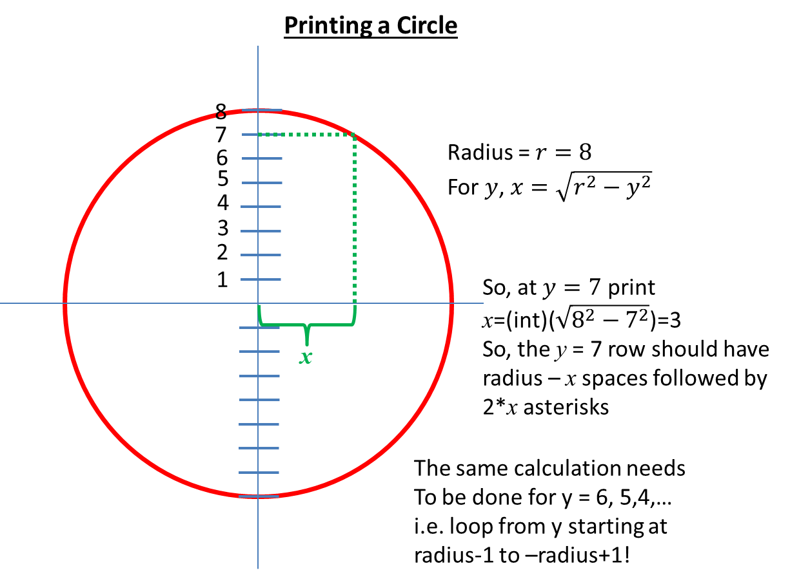
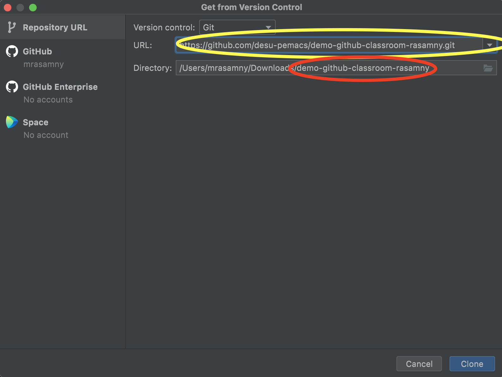
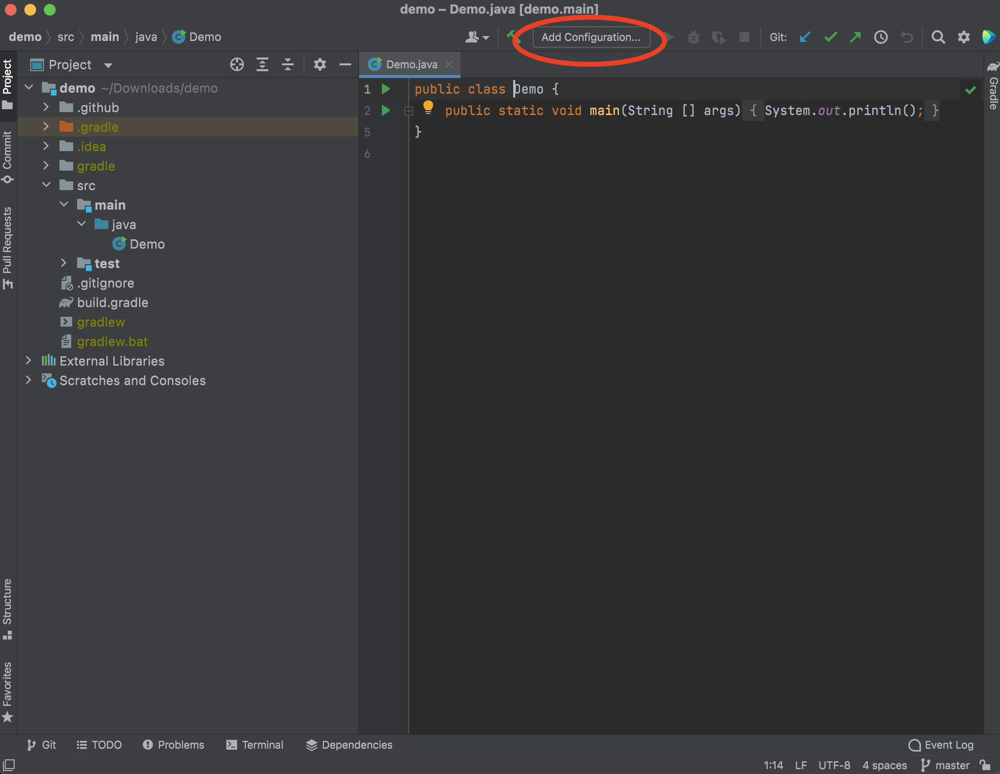
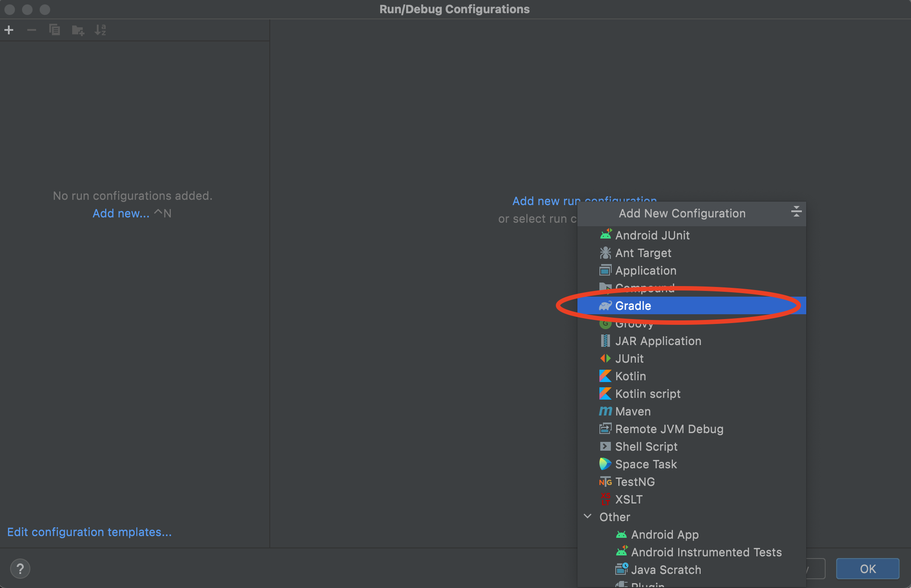
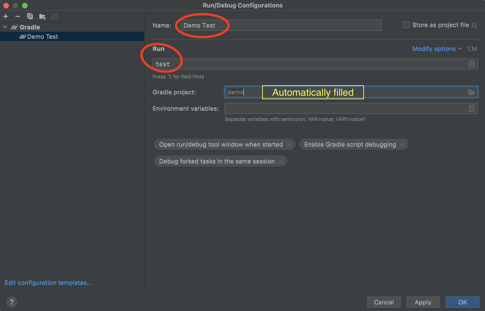
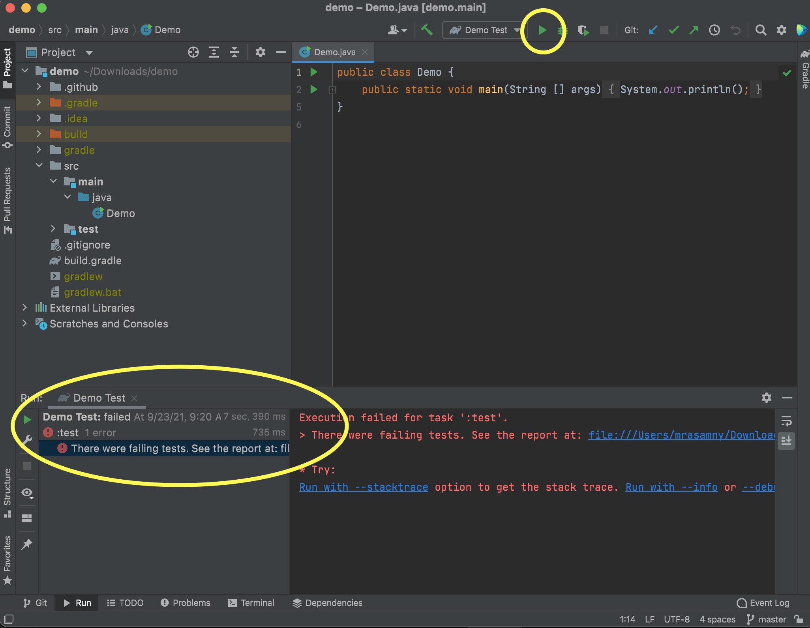

# Recitation 5 - Loopy Loops

## Objective

This Recitation will require you to write several functions in which loops will be the focus. So, let's get started!

At the end of this Recitation exerciseRecitation5, a studnet will be able to:

- Implemet for and while loops
- Translate shape equations to text patterns

## Left Triangle

In the template below, Recitation5 has a method with the following signature:
<p style="font-family: 'courier new', courier;background-color:#f5f5f5;padding:10px 10px 10px 10px;border:solid 1px #dddddd;color:blue;font-weight:bold;">
public static String leftRightTriangle(int height)
<p>
that returns a string consisting of asterisks in a left-right triangle pattern with a height, 
<span style="font-family: 'courier new', courier;font-weight:bold;">height</span>.  When the method is 
invoked as follows:

```java
Recitation5.leftRightTriangle(5);
```
the result is a string that is equivalent to the following:

```
*\n**\n***\n****\n*****\n
```

If printed,

```java
System.out.println(Recitation5.leftRightTriangle(5));
```

The result is:

```
*
**
***
****
*****
```

Invoking the method with a different argument,

```java
Recitation5.leftRightTriangle(3)
```

results in,

```
*\n**\n***\n
```

and if printed,

```
System.out.println(Recitation5.leftRightTriangle(3));
```

results in,

```
*
**
***
```

## Right Triangle

In the template below, Recitation5 has a method with the following signature:
<p style="font-family: 'courier new', courier;background-color:#f5f5f5;padding:10px 10px 10px 10px;border:solid 1px #dddddd;color:blue;font-weight:bold;">
public static String rightRightTriangle(int height)
<p>
that returns a string consisting of asterisks in a right-right triangle pattern with a height, <span style="font-family: 'courier new', courier;font-weight:bold;">height</span>.  When the method is invoked as follows:

```java
Recitation5.rightRightTriangle(5);
```

the result is a string that is equivalent to the following:

```
    *\n   **\n  ***\n ****\n*****\n
```

If printed,

```java
System.out.println(Recitation5.rightRightTriangle(5));
```

The result is:

```
    *
   **
  ***
 ****
*****
```

Invoking the method with a different argument,

```java
Recitation5.rightRightTriangle(3)
```

results in,

```
  *\n **\n***\n
```

and if printed,

```java
System.out.println(Recitation5.rightRightTriangle(3));
```

results in

```
  *
 **
***
```
## Let's Draw a Circle - Yay!

The template below has a static method with the following signature:
<p style="font-family: 'courier new', courier;background-color:#f5f5f5;padding:10px 10px 10px 10px;border:solid 1px #dddddd;color:blue;font-weight:bold;">
public static String circle(int radius)
</p>

That returns a string of asterisks representing a circle pattern with a radius, <span style="font-family: 'courier new', courier;font-weight:bold;">radius</span>.  When the method is invoked as follows:

```java
Recitation5.circle(5)
```

the result is a string as follows,

```
  ******\n ********\n ********\n ********\n**********\n ********\n ********\n ********\n  ******
```

If printed,

```java
System.out.println(Recitation5.circle(5))
```

the result is,

<pre style="font-family: 'courier new', courier;background-color:#f5f5f5;padding:5px 10px 5px 0px;border:solid 1px #dddddd;">
  ******
 ********
 ********
 ********
**********
 ********
 ********
 ********
  ******
</pre>

Invoking the method with a different argument, 

```java
Recitation5.circle(8)
```

the result is a string as follows,

```
"     ******\n   **********\n  ************\n  ************\n **************\n **************\n **************\n****************\n **************\n **************\n **************\n  ************\n  ************\n   **********\n     ******\n"
```

If printed,

```java
System.out.println(Recitation5.circle(8))
```

the result is,

<pre style="font-family: 'courier new', courier;background-color:#f5f5f5;padding:5px 10px 5px 0px;border:solid 1px #dddddd;">
     ******
   **********
  ************
  ************
 **************
 **************
 **************
****************
 **************
 **************
 **************
  ************
  ************
   **********
     ******
</pre>

The above pictures look more of an oval than a circle. This is because of the aspect ratio of the text characters and the resolution of displaying it using characters.  The height of a character is about twice the width. If you place a space after each asterisks, you will see that the image will look more like a circle.

An explanation of how to calculate the number of asterisks to print on each line is provided in the illustration below.



Note that you do not need to calculate <span style="font-family: 'times new roman', times;font-weight:bold;font-style:italic;">x</span> for <span style="font-family: 'times new roman', times;font-weight:bold;font-style:italic;">y = r</span> or for <span style="font-family: 'times new roman', times;font-weight:bold;font-style:italic;">y = -r</span> since for both these values, <span style="font-family: 'times new roman', times;font-weight:bold;font-style:italic;">x = 0</span>.  So, you can use a for-loop that goes from <span style="font-family: 'courier new', courier;font-weight:bold;">radius-1 to -radius+1, inclusively or radius-1 to -radius, exclusively of -radius</span>.

## Cloning the Recitation

Click on the link in Blackboard or this <a href="">link</a> to accept the assignment on Github classroom.  Once the repository is created, copy the link by clicking on the Clone button in your Github repository.

Do the following steps:

1. Click the **Get from VCS** button in IntelliJ, and paste the URL you copied from your Github repo in the textbox next to URL as shown in the picture.  Make sure that the name of the repo also appears in the textbox under Directory.<p style="text-align:center;"></p>
2. Press the Clone button. IntelliJ will create the folder for you and place the assignment code in the directory or folder with the name of the repo and your project should show on the IntelliJ window.
3. To set up the run configuration, click on the **Add Configuration** or **Edit Configuration** as shown in the image below.<p style="text-align:center;"></p>
4. select Gradle from the menu as shown in the image below.<p style="text-align:center;"></p>
5. Give the configuration a name, for example **Test**, and type test in the run textbox then click OK to complete the run configuration. NOTE: the image is based on the steps from the first recitation.<p style="text-align:center;"></p>
6. To run the tests, just press the <span style="color:green">**Green**</span> play button as shown in the image below.<p style="text-align:center;"></p>